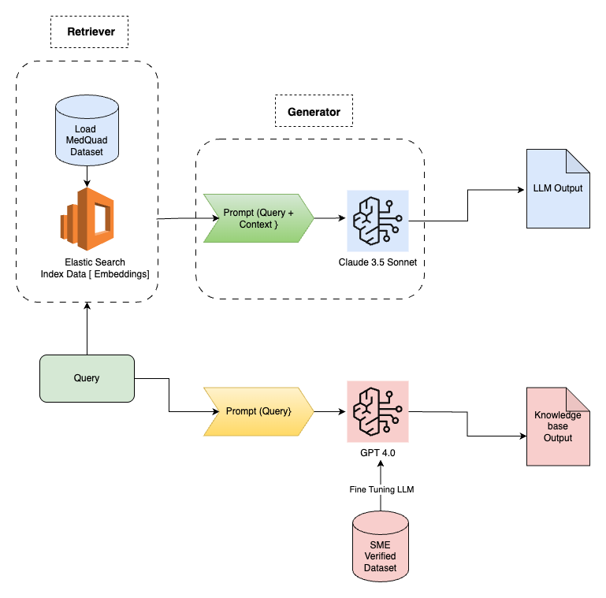
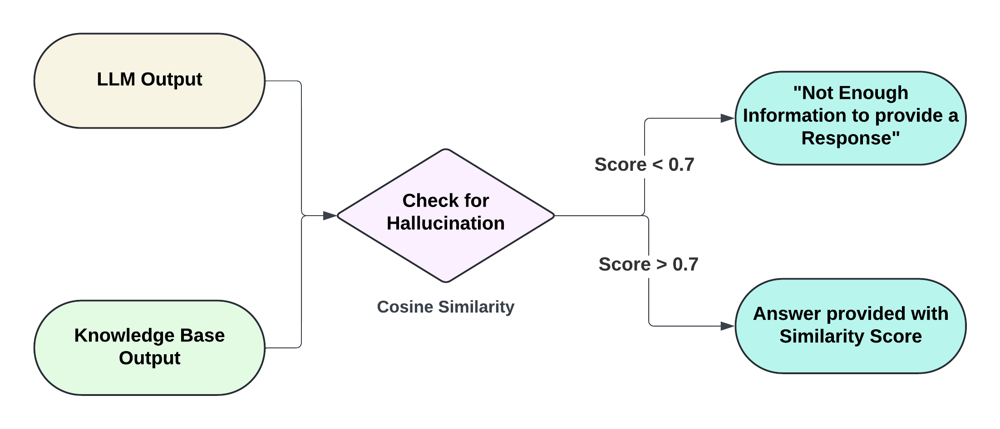
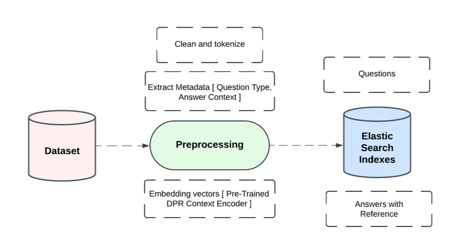

# Hallucination Mitigation in Medical Question Answering Using RAG

This repository presents the system design and approach behind our capstone project at **Columbia University**, conducted in collaboration with **Elsevier**. The project targets a critical challenge in medical AI: **hallucinations in Large Language Models (LLMs)**—where models generate plausible-sounding but factually incorrect information.

While we are unable to share the codebase due to data confidentiality with Elsevier, this repository shares a detailed overview of our **multi-stage Retrieval-Augmented Generation (RAG) architecture**, **hallucination detection pipeline**, and insights from working with high-stakes, domain-specific medical data (e.g., MedQuAD, NIH, Mayo Clinic).

---

## 🔍 Problem Statement

LLMs, when used in Medical Question Answering (MQA), often hallucinate responses not grounded in trusted medical knowledge—posing serious risks to **patient safety** and **clinical decision-making**. Our goal was to design a robust, scalable framework that minimizes hallucinations through data grounding and verification.

---

## 💡 Our Solution

We designed a **dual-model pipeline** combining:
- Retrieval via **ElasticSearch** and **Dense Passage Retrieval (DPR)**
- Answer generation using **Claude 3.5 (Amazon Bedrock)**
- Validation using **GPT-4**, SME-verified datasets, and **cosine similarity scoring**

Responses were accepted only if alignment scores exceeded 0.7—flagging hallucinations otherwise. This framework also supports **refinement loops**, multi-model diversity, and future extensions like PubMed-based validation and confidence scoring.

---

## 🧠 My Contribution

As part of a 4-member team, I led the **system design and RAG architecture** development. I integrated structured medical data with large-scale retrieval and built the backbone of our scalable inference system, balancing performance and accuracy in high-sensitivity domains.

---

## 🚪 Key Highlights

- Used **MedQuAD** with 47K+ Q&A pairs as primary dataset
- Deployed models via **Amazon Bedrock**
- Built a knowledge-grounded hallucination detection pipeline with automated re-evaluation
- Presented our work at multiple Columbia University AI events

---

## 📁 Report

A full technical report with system architecture diagrams, evaluation, and future directions is included:
[Report.pdf](./Hallucination_Mitigation_Strategies_in_Medical_Question_Answering__MQA__Final.pdf)

---

---

## 🛠️ System Architecture

The project is built using a modular, interpretable pipeline to ensure factual accuracy and reduce hallucinations in medical LLM outputs. Below are core components of the system:

### 1. End-to-End System Overview

- Queries are retrieved from an ElasticSearch index built on **MedQuAD** embeddings.
- Retrieved context is passed to **Claude 3.5 Sonnet** for generation.
- In parallel, **GPT-4.0**, fine-tuned on SME-verified data, generates a reference answer.
- The two responses are compared to detect hallucinations.

---

### 2. Hallucination Detection Logic

- LLM output and reference answers are compared using **Cosine Similarity**.
- If similarity < 0.7 → response is flagged as hallucinated.
- If similarity ≥ 0.7 → output is shared with similarity score.

---

### 3. Query Processing in ElasticSearch

- User queries are embedded and passed to **ElasticSearch**.
- Top-ranked documents are retrieved (e.g., using BM25).
- Contexts are appended to prompts and passed to the LLM.

---

## 🙏 Acknowledgment

Special thanks to **Elsevier**, **DSI at Columbia University**, and our capstone mentor for their support and collaboration.

---

## 📄 Disclaimer

This project was developed as part of an academic capstone at Columbia University and is intended solely for **educational and reference purposes**. It is based on publicly available research and does not contain any proprietary or sensitive code or data. Please do not use this work for commercial purposes without explicit permission. All rights reserved by the respective collaborators and institutions.

